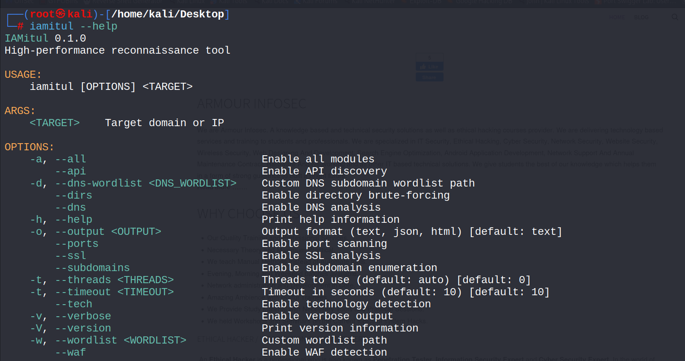
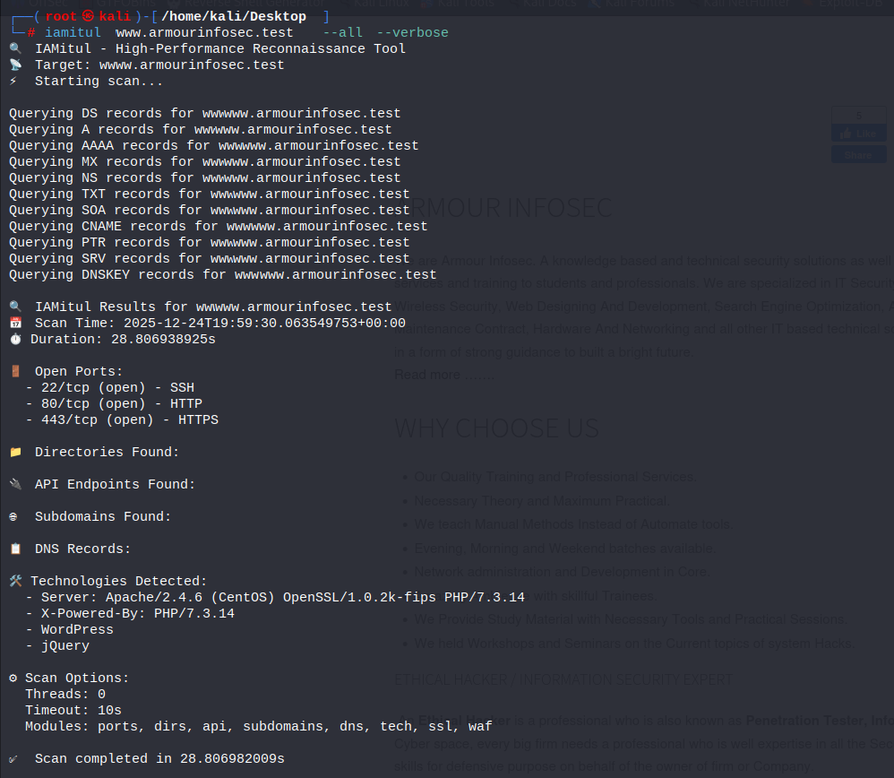

# 🔍 IAMitul – High-Performance Reconnaissance Tool


A blazing-fast, comprehensive reconnaissance tool written in **Rust** for **security professionals, penetration testers, and CTF players**.

---

## 🌟 Features

- ⚡ **High Performance** – Built with Rust for maximum speed and efficiency  
- 🔍 **Comprehensive Scanning** – All-in-one reconnaissance capabilities  
- 🧩 **Modular Design** – Enable only the modules you need  
- 📊 **Multiple Output Formats** – Text, JSON, and HTML reports  
- 🛡️ **WAF Detection** – Identify Web Application Firewalls  
- 🔒 **SSL Analysis** – Detailed certificate inspection  
- 🌐 **Subdomain Enumeration** – Discover related domains  
- 📁 **Directory Brute-Forcing** – Find hidden directories and files  
- 🔌 **API Discovery** – Uncover API endpoints  
- 🚪 **Port Scanning** – Identify open ports and services  
- 📋 **DNS Analysis** – Gather DNS records  
- 🛠️ **Technology Detection** – Identify web technologies  

---
<p align="center">
  
</p>

<p align="center">
  
</p>

## 🎬 Demo

[Watch Demo Video](Images/A%20High-Performance%20Reconnaissance%20Tool%20built%20with%20Rust!.mp4)


## 📦 Installation

### From Source (Recommended)

#### 1️⃣ Install Rust
```bash
curl --proto '=https' --tlsv1.2 -sSf https://sh.rustup.rs | sh

Restart your terminal after installation.

2️⃣ Clone and Build
git clone https://github.com/yourusername/iamitul.git
cd iamitul
cargo build --release

3️⃣ Install System-Wide
sudo cp target/release/iamitul /usr/local/bin/


Verify installation:

iamitul --version

Pre-compiled Binaries

Download the latest binary from the Releases page.

🚀 Usage

Comprehensive Scan
iamitul example.com --all

JSON Output
iamitul example.com --all --output json > scan_results.json

HTML Report
iamitul example.com --all --output html > report.html

Specific Modules
iamitul example.com --ports --ssl --waf --verbose

Custom Wordlist
iamitul example.com --dirs --wordlist /path/to/wordlist.txt

⚙️ Command Line Options
Option	Description	Default
<TARGET>	Target domain or IP	Required
-a, --all	Enable all modules	-
--api	Enable API discovery	-
--dns	Enable DNS analysis	-
--dirs	Enable directory brute-forcing	-
--ports	Enable port scanning	-
--ssl	Enable SSL analysis	-
--subdomains	Enable subdomain enumeration	-
-t, --threads	Threads to use (0 = auto)	0
-T, --timeout	Timeout in seconds	10
-v, --verbose	Enable verbose output	-
--waf	Enable WAF detection	-
-w, --wordlist	Custom wordlist path	-
-o, --output	Output format (text/json/html)	text
-V, --version	Print version information	-
🔧 Modules
🔌 Port Scanner

Scans common TCP ports

Identifies service and version

Fast asynchronous scanning

📁 Directory Brute-Forcing

Discovers hidden directories and files

Custom or built-in wordlists

Concurrent HTTP requests

🔍 API Discovery

Finds common API endpoints

Detects REST and GraphQL APIs

🌐 Subdomain Enumeration

Discovers subdomains using multiple techniques

Concurrent DNS resolution

📋 DNS Analysis

Gathers A, AAAA, MX, NS, TXT, SOA records

Identifies misconfigurations

🛠️ Technology Detection

Detects frameworks, servers, and libraries

Analyzes headers and page content

🔒 SSL Analysis

Certificate inspection

TLS version detection

Vulnerability checks

🛡️ WAF Detection

Detects common WAF products

Analyzes headers and responses

📄 Output Formats
Text

Clean, human-readable output with color-coded sections.

JSON

Structured output for automation and integrations.

HTML

Professional reports suitable for documentation and presentations.

📁 Wordlists

Built-in wordlists:

common.txt

directories.txt

api_endpoints.txt

subdomains.txt

Install SecLists (Recommended)
sudo apt update && sudo apt install seclists


🏗️ Architecture
iamitul/
├── Cargo.toml
├── src/
│   ├── main.rs
│   ├── cli.rs
│   ├── modules/
│   │   ├── port_scanner.rs
│   │   ├── dirbuster.rs
│   │   ├── api_discovery.rs
│   │   ├── subdomain_enum.rs
│   │   ├── dns_analysis.rs
│   │   ├── tech_detection.rs
│   │   ├── ssl_analysis.rs
│   │   └── waf_detection.rs
│   ├── utils/
│   │   ├── output.rs
│   │   ├── config.rs
│   │   └── progress.rs
│   └── wordlists/
│       ├── common.txt
│       ├── directories.txt
│       ├── api_endpoints.txt
│       └── subdomains.txt
├── README.md
├── LICENSE
└── examples/
    ├── basic_scan.txt
    └── json_output.json

🚀 Performance Highlights

Asynchronous processing

Parallel DNS resolution

Connection pooling

Optimized wordlists

Configurable threading

🤝 Contributing

Contributions are welcome!

git checkout -b feature/amazing-feature
git commit -m "Add amazing feature"
git push origin feature/amazing-feature


Open a Pull Request 🎉

📜 License

Licensed under the MIT License.

⚠️ Disclaimer

This tool is for educational and authorized security testing only.
You are responsible for obtaining permission before scanning any systems.

🙏 Acknowledgments

Rust & Tokio

Clap CLI framework

SecLists by Daniel Miessler

Security research community


Made with ❤️ for the security community
